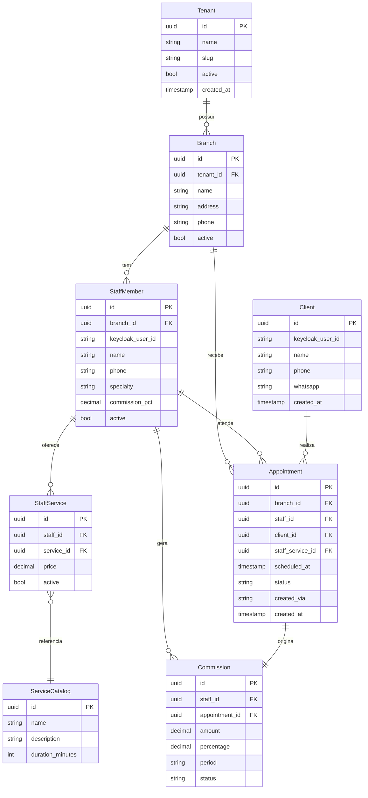

# AgendAI — Diagrama Entidade-Relacionamento (DER)

## Decisões de design

- **Tenant** representa a rede/salão. Um tenant pode ter múltiplas unidades (`Branch`)
- **Branch** é a unidade física. Profissionais e agendamentos pertencem a uma Branch
- **StaffMember** tem `keycloak_user_id` para linkar com o Keycloak e `specialty` para distinguir cabeleireiro, manicure, pedicure, etc
- **ServiceCatalog** é um catálogo global de serviços. O profissional referencia esse catálogo via `StaffService` e define seu próprio preço
- **StaffService** representa os serviços que cada profissional oferece com preço específico
- **Client** tem `whatsapp` para a integração com o agente LLM
- **Appointment** liga branch + profissional + cliente + serviço. O campo `created_via` registra a origem (web, mobile, whatsapp)
- **Commission** é gerada por agendamento concluído. O campo `period` suporta cálculo por agendamento e por período (semanal/mensal)

---

## Regras de negócio

- Um `Tenant` pode ter várias `Branch` (multi-unidade)
- Um `StaffMember` pertence a uma `Branch`
- Um `StaffMember` define seus próprios serviços e preços via `StaffService`
- Um `Client` pode agendar em qualquer `Branch`
- Um `Appointment` sempre gera uma `Commission` ao ser concluído
- Operações destrutivas (delete) são exclusivas do painel autenticado — nunca expostas via MCP

---

## Diagrama

---

## Entidades e campos

### Tenant
| Campo | Tipo | Descrição |
|---|---|---|
| id | uuid PK | Identificador único |
| name | string | Nome da rede/salão |
| slug | string | Identificador URL amigável |
| active | bool | Tenant ativo |
| created_at | timestamp | Data de criação |

### Branch
| Campo | Tipo | Descrição |
|---|---|---|
| id | uuid PK | Identificador único |
| tenant_id | uuid FK | Referência ao Tenant |
| name | string | Nome da unidade |
| address | string | Endereço físico |
| phone | string | Telefone de contato |
| active | bool | Unidade ativa |

### StaffMember
| Campo | Tipo | Descrição |
|---|---|---|
| id | uuid PK | Identificador único |
| branch_id | uuid FK | Referência à Branch |
| keycloak_user_id | string | ID do usuário no Keycloak |
| name | string | Nome do profissional |
| phone | string | Telefone |
| specialty | string | Especialidade (cabeleireiro, manicure, etc) |
| commission_pct | decimal | Percentual de comissão base |
| active | bool | Profissional ativo |

### Client
| Campo | Tipo | Descrição |
|---|---|---|
| id | uuid PK | Identificador único |
| keycloak_user_id | string | ID do usuário no Keycloak |
| name | string | Nome do cliente |
| phone | string | Telefone |
| whatsapp | string | Número WhatsApp para integração LLM |
| created_at | timestamp | Data de cadastro |

### ServiceCatalog
| Campo | Tipo | Descrição |
|---|---|---|
| id | uuid PK | Identificador único |
| name | string | Nome do serviço (corte, manicure, etc) |
| description | string | Descrição do serviço |
| duration_minutes | int | Duração estimada em minutos |

### StaffService
| Campo | Tipo | Descrição |
|---|---|---|
| id | uuid PK | Identificador único |
| staff_id | uuid FK | Referência ao StaffMember |
| service_id | uuid FK | Referência ao ServiceCatalog |
| price | decimal | Preço cobrado pelo profissional |
| active | bool | Serviço ativo |

### Appointment
| Campo | Tipo | Descrição |
|---|---|---|
| id | uuid PK | Identificador único |
| branch_id | uuid FK | Referência à Branch |
| staff_id | uuid FK | Referência ao StaffMember |
| client_id | uuid FK | Referência ao Client |
| staff_service_id | uuid FK | Referência ao StaffService |
| scheduled_at | timestamp | Data e hora do agendamento (UTC) |
| status | string | confirmed, completed, cancelled, no_show |
| created_via | string | web, mobile, whatsapp |
| created_at | timestamp | Data de criação (UTC) |

### Commission
| Campo | Tipo | Descrição |
|---|---|---|
| id | uuid PK | Identificador único |
| staff_id | uuid FK | Referência ao StaffMember |
| appointment_id | uuid FK | Referência ao Appointment |
| amount | decimal | Valor da comissão em reais |
| percentage | decimal | Percentual aplicado |
| period | string | Período de referência (ex: 2026-03) |
| status | string | pending, paid |